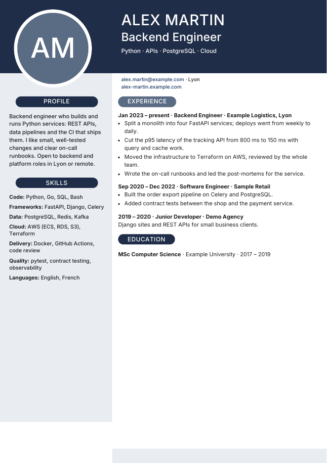
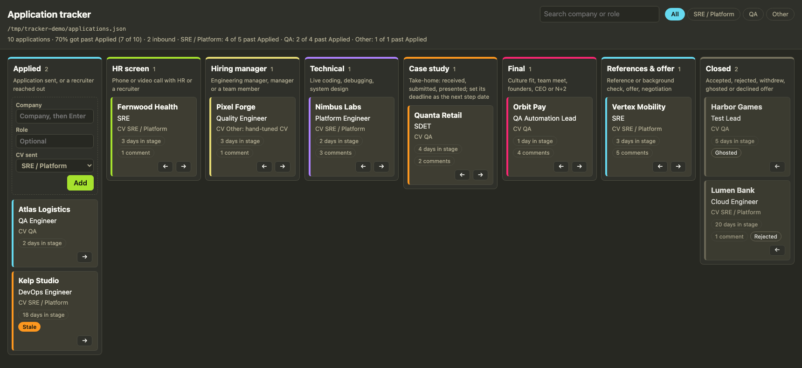

# CV as code

A **CV generator** (one-page A4 PDFs, checked for ATS robots) and a private **job-application board**, in one repo.





## Start

**Use this template** on GitHub, create the copy as a **private** repo, then:

```
cp -R profiles/_template profiles/<you>   # edit profiles/<you>/content.js and facts.md
./build.sh <you>                          # -> out/<you>/*.pdf
./tracker.sh                              # -> http://127.0.0.1:8765/
./new-application.sh "Company" "Role" main  # -> applications/<date>-<company>-<role>/ (posting from clipboard, motivation draft, gap check)
./application-cv.sh applications/<dir>    # -> one-off CV for that application, from a variant X added to content.js then removed
```

With Claude Code or Cursor, give the agent a job posting: `AGENTS.md` and `.claude/skills/new-application/` make it run the whole application, from company research to the tailored CV and the motivation.

